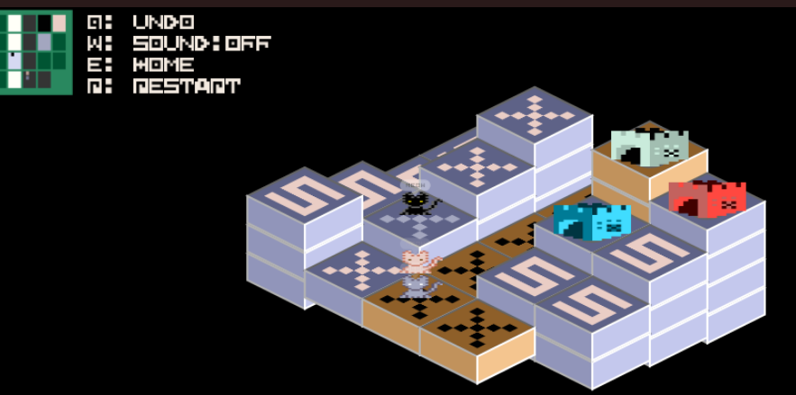

# 2025-JS13K  

*Cats must return home together!*  

## About this game  

Hi there! Cats are lost. The owner waits.  
A black cat knows the way. Lead them. Guide them.  
**Together, they must return!!**  

Players must use their wits to guide all the cats home safely.  
Use the arrow keys to move — but be careful: if you take **13 steps without success**, you’ll lose the stage.  
Don’t worry though, after each failure, a small hint might appear to help you along the way! XDD  

It’s a puzzle-solving experience about teamwork, planning,  
and the joy of bringing everyone back home together.  

**Have fun!**  

---

### Type:  
- Desktop / Phone  

### Stage: 16 Levels !!  
+ Each stage requires **all cats to arrive home together**.  
+ Every stage always has a solution.  
+ Sometimes, there may be more than one solution.  
+ Don’t worry, a small hint will appear after each failure to help you along the way!
---

### Control :  
- **Move**: ↑ ↓ ← →  
- **Undo**: Q  
- **Sound On/Off**: W  
- **Menu**: E  
- **Restart**: R  
- **Mouse / Tap**: Click  
- **Drag**: Mouse Move / Hold  

---

### Extra Notes :  
+ Each item’s function matches the **color of a cat**.  

---

### Coding tool :  
- [ ] Vscode  
- [ ] Firefox, Chrome  